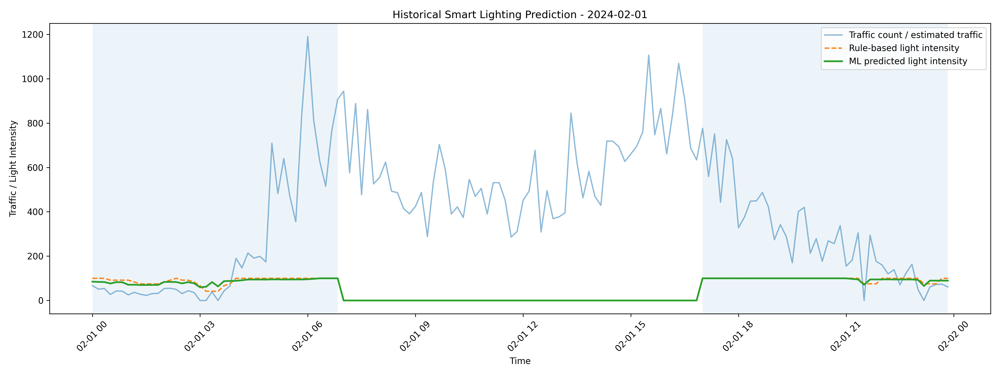

# Enviotech Smart Lighting Prototype

## Overview
ML-based street lighting system that adjusts brightness based on:
- Traffic flow  
- Time of day  
- Environmental conditions (sunlight)  

The system simulates real-world traffic behavior and predicts optimal lighting intensity to improve energy efficiency while maintaining safety.

---

## Demo / Output Preview

Below is a sample output generated by the system:



The blue line represents traffic flow, while the green line shows the ML-predicted light intensity.  
The system adapts brightness dynamically based on traffic intensity and contextual features.

---

## Run

### Run Full Pipeline (Train + Simulate)

```bash
python src/run_pipeline.py
```

This will:
- preprocess and merge datasets  
- simulate traffic (10-minute intervals)  
- generate features  
- train the ML model  
- produce prediction outputs  

---

### Run Visualization (Using Pre-trained Model)

```bash
python main.py
```

This launches a Flask app that:
- loads the pre-trained model (`models/smart_light_model.pkl`)  
- generates predictions  
- displays traffic vs brightness graphs  

---

### Test Saved Model (Optional)

```bash
python src/test_saved_model.py
```

Useful for validating the trained model without running the full pipeline.

---

## Approach

1. Data collection and merging from multiple sources  
2. Preprocessing and feature engineering  
3. Traffic simulation using Poisson distribution  
4. ML model training  
5. Pipeline execution via `run_pipeline.py`  
6. Visualization using Flask (`main.py`)  

---

## Features

- Traffic simulation (Poisson-based)  
- 10-minute interval modeling from hourly data  
- ML-based dimming prediction  
- End-to-end pipeline execution  
- Flask-based visualization  

---

## Project Structure

- `data/` → raw + processed datasets  
- `src/` → pipeline scripts  
- `models/` → trained ML models  
- `outputs/` → figures and results  
- `docs/references/` → data sources  

---

## Setup

```bash
git clone https://github.com/NirvikMazumdar/Smart-Lighting-Prototype.git
cd Smart-Lighting-Prototype
python -m venv venv
venv\Scripts\activate   # Windows
pip install -r requirements.txt
```

---

## Strengths

- Full end-to-end ML pipeline (data → simulation → prediction → visualization)  
- Realistic traffic modeling using Poisson distribution  
- Handles data engineering challenges (merging multiple datasets)  
- Modular pipeline for reproducibility  
- Visualization layer for interpretability  

---

## Limitations

- Hourly source data (no real-time input)  
- 10-minute intervals are simulated, not observed  
- Poisson simulation may not capture real traffic spikes  
- Predictions are relatively smooth / flat  
- Limited responsiveness to sudden changes  
- Data preprocessing required significant effort  

---

## Scalability & Future Improvements

- Integrate real-time traffic APIs and sensor data  
- Use real smart lighting infrastructure (e.g., Enviotech systems)  

- Explore advanced models:
  - improved regression models  
  - contextual bandits / reinforcement learning  

- Optimize for:
  - smoother brightness transitions  
  - energy efficiency  
  - hardware longevity  

With real-world data and feedback loops, this system can evolve into a fully adaptive smart lighting solution.

---

## Data Sources

See: `docs/references/enviotech_data_sources.md`